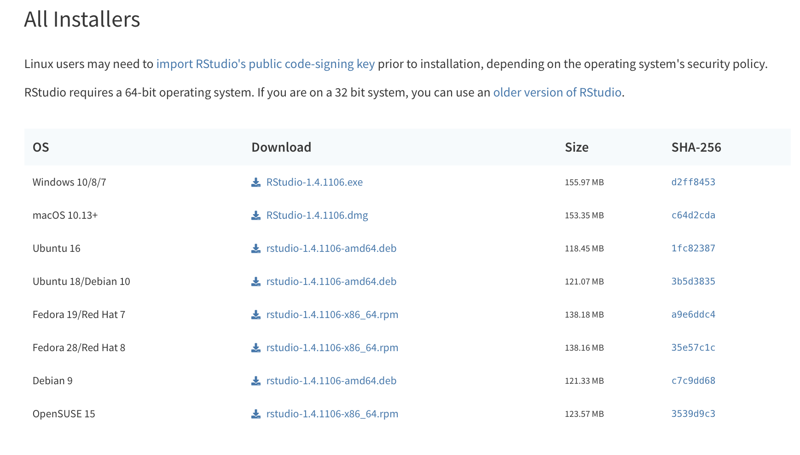

# Introduction to R and RStudio {.tabset}

Throughout the book we include R code for estimation, simulation, and creating examples. We used RStudio to create the slides. To personalize them for your own purpose, we assume you will use R Markdown. Below, we include guides to setting up R and RStudio on your machine, as well as some basic commands that are frequently used.

## R and RStudio

R is a free software environment most commonly used for statistical analysis and computation. Because Learning Days participants arrive with different statistical backgrounds and preferred statistical software, we use R to ensure that everyone is on the same page.  We advocate the use of R more generally for its flexibility, wealth of applications, and comprehensive support mostly through online fora. 

RStudio is a free, open source integrated development environment with a user interface that makes R much more user-friendly. R Markdown, a feature of RStudio, enables the easy output of code, results, and text in a .pdf, .html, or .doc format. 

## Downloading R and RStudio

### Downloading R

R can be freely downloaded from CRAN at the link corresponding to your operating system:

- For **Windows**: [https://cran.r-project.org/bin/windows/base/](https://cran.r-project.org/bin/windows/base/)
- For **Mac OS X**: [https://cran.r-project.org/bin/macosx/](https://cran.r-project.org/bin/macosx/).   
    - Select `R-4.2.1.pkg` for OS X 10.13 and higher.
    - Select `R-3.6.3.nnpkg` for OS X 10.11-10.12.
    - Select `R-3.3.3.nnpkg` for OS X 10.19-10.10.
    - Select `R-3.2.1-snowleopard.pkg` for OS X 10.6-10.8.

### Downloading RStudio

RStudio can be freely downloaded from the RStudio website, [https://www.rstudio.com/products/rstudio/download/](https://www.rstudio.com/products/rstudio/download/). In the table, click the blue `Download` button at the top of the left column, "RStudio Desktop Open Source License" as depicted below in Figure B.1. Once you select this button, the page will jump to a list of download options as depicted in Figure B.2.

- For **Windows**, select `Windows 10/8/7`.
- For **Mac OS X**, select `Mac OS X 10.13+`.


```{r rstudiopng, echo=FALSE, out.width='80%', fig.show='hold', fig.cap='Select Download in the "RStudio Desktop Open Source License" column.'}
knitr::include_graphics(here("Images","new_rstudio.png"))
```

```{r rstudiodownload, echo=FALSE, out.width='80%', fig.show='hold', fig.cap='Select the Windows 10/8/7 link for Windows or the Mac OS X 10.13+ link for Mac.'}

```

## RStudio Interface

When you open RStudio for the first time, there should be three panels visible, as depicted in Figure B.3 below.

- Console (left panel)
- Accounting (upper right panel): includes Environment and History tabs
- Miscellaneous (lower right panel)

```{r rstudiointro, echo=FALSE, out.width='80%', fig.show='hold', fig.cap='When you open RStudio, there are three panels visible: the Console (left), Accounting (upper right), and Miscellaneous (lower right).'}
knitr::include_graphics("Images/rstudio_intro.png")
```

### Console

You can execute all operations in the console. For example if you enter `4 + 4` and hit the Enter/Return key, the Console will return `[1] 8`. 

To make sure everyone is prepared to use R at Learning Days, we ask participants to run one line of code in the Console to download several R packages. Packages are fragments of reproducible code that allow for more efficient analysis in R. To run these lines, copy the following code into the Console and hit your  `Return`/`Enter` key.  You must be connected to the internet to download packages.

```{r, eval = F}
install.packages(c("ggplot2", "dplyr", "AER", "arm", "MASS", "sandwich", 
                   "lmtest", "estimatr","coin","randomizr", "DeclareDesign"))
```

If successfully downloaded, your Console will resemble Figure B.4, except that the urls will differ depending on your location. 
```{r console2, echo=FALSE, out.width='40%', fig.show='hold',fig.cap='An image of the Console after executing the three lines of code listed above.'}
knitr::include_graphics("Images/console2a.png")
```

### Editor 

In order to write and save reproducible code, we will open a fourth panel, the Editor, by clicking on the icon with a white page with a plus sign on the upper-left corner of the RStudio interface and selecting `R Script`, as depicted in Figure B.5.

```{r newscript,  echo=FALSE, out.width='60%', fig.show='hold',fig.cap='Create a new R script and open the editor panel by selecting `R Script` from the dropdown menu.'}
knitr::include_graphics("Images/new_script.png")
```

Once the R script is opened, there should be four panels within the RStudio interface, now with the addition of the Editor panel. We can execute simple arithmetic by entering a formula in the editor and pressing `Control + Enter` (Windows) or `Command + Enter` (Mac). The formula and the "answer" will appear in the Console, as depicted in Figure B.6, with red boxes added for emphasis.


```{r firstaddition,  echo=FALSE, out.width='60%', fig.show='hold', fig.cap='An arithmetic expression is entered in the editor and evaluated in the console. The red boxes are added for emphasis.'}
knitr::include_graphics("Images/first_addition.png")
```

R can be used for any arithmetic operation including, but not limited to, addition (`+`), subtraction (`-`), scalar multiplication (`*`), division (`/`), and exponentiation (`^`). 

### Accounting 

Beyond basic functions, we can also store values, data, and functions in the global environment. To assign a value to a variable, use the `<-` operator. All stored values, functions, and data will appear in the Environment tab in the Accounting panel. In Figure B.7, we define the variable `t` to take the value $3 \times \frac{6}{14}$, and can see that it is stored under Values. 

We also load a dataset. Here, "ChickWeight" is a dataset built into R; most datasets will be loaded from the web or other files on your computer through an alternate method. We can see that ChickWeight contains 578 observations of 4 variables and is stored in the Environment. By clicking on the name ChickWeight a tab will enter with the dataset in your Editor window.

```{r savedata, echo=FALSE, out.width='60%', fig.show='hold', fig.cap='The value 3 * (6/14) is assigned to the variable t (red) and the dataset ChickWeight is added to the global environment (blue). The boxes are added for emphasis.'}
knitr::include_graphics("Images/save_data.png")
```

The Learning Days workshops use many tools in R to analyze and view data. For now, we can learn some basic tools to examine the data. The function `head()` allows us to see the first six rows of the dataset. `summary()` summarizes each of the columns of the dataset and `dim()` provides the dimensions of the dataset with first the number of rows and then columns. 

```{r, warning = F, message = F}
head(ChickWeight) # First 6 observations in dataset
summary(ChickWeight) # Summary of all variables
dim(ChickWeight) # Dimensions of the dataset in the order rows, columns
```

Unlike other statistical software, R allows users to store multiple datasets, possibly of different dimensions, simultaneously.  This feature makes R quite flexible for analysis using multiple methods.

### Miscellaneous 

R provides a suite of tools, ranging from built-in plot functions to packages to graph data, models, estimates, etc. The final Miscellaneous panel allows for the quick viewing of graphs in RStudio. Figure B.8 shows a plot in this panel.  Leaning Days will discuss how to plot data; for now, don't worry about the graphing the code in the Editor. 

```{r graph, out.width='60%',  echo=FALSE, fig.show='hold', fig.cap='An example plot of the `ChickWeight` data made in R.'}
knitr::include_graphics("Images/graph.png")
```

## Learning to Use R

### Online Resources

There are many helpful online resources to help you start learning R. We recommend two sources:

- Code School, which runs entirely through your browser [https://www.codeschool.com/courses/try-r](https://www.codeschool.com/courses/try-r). 
- Coursera, via an online R Programming course organized by Johns Hopkins University: 
    i. Go to [https://www.coursera.org](https://www.coursera.org)
    ii. Create an account (this is free!)
    iii. Sign up for R Programming at Johns Hopkins University (instructor: Roger Peng) under the "Courses" tab
    iv. Read the materials and watch the videos from the first week. The videos from the first week are about 2.5 hours long total.  
    
### Basic Practice

Here we provide some fragments of code to familiarize you with some basic practices in R. We recommend that you practice by typing the code fragments into your Editor and then evaluating them.

#### Setting up an R Session

In general, we read other files such as data or functions into R and output results like graphs or tables into files not contained within an R session. To do this, we must give R an "address" at which it can locate such files. It may be most efficient to do this by setting a working directory, a file path at which relevant files are stored. We can identify the current working directory using `getwd()` and set a new one using `setwd()`. Note that the syntax of these filepaths varies by operating system.

```{r, eval=F, echo=TRUE}
getwd()
```

```{r, eval = F}
setwd("~TaraLyn/EGAP Learning Days Admin/Workshop 2018_2 (Uruguay)/")   
```

You may need to install packages beyond those listed above to execute certain functions. To install packages we use `install.packages("")`, filling in the package name between the "" marks, as follows. You need only install packages once.

```{r,eval=FALSE, echo=TRUE}
install.packages("randomizr")  
```

Once a package is installed, it can be loaded and accessed using `library()` where the package name is inserted between the parentheses (no "" marks).

```{r, eval= F, echo=TRUE}
library(randomizr)
```

To clear R's memory of the stored data, functions, or values that appear in the accounting tab, use `rm(list = ls())`. It may be useful to set a random number seed to ensure that replication is possible in a different R session, particularly when we work with simulation-based methods.

```{r echo=TRUE}
rm(list = ls())                                   
set.seed(2018)  # Optional: Set a seed to make output replicable
```

#### R Basics

We now explore some basic commands. In order to assign a scalar (single element) to a variable, we use the `<-` command as discussed previously: 

```{r echo=TRUE}
# "<-"  is the assignment command; it is used to define things. eg:
(a <- 5)     
```

We may also want to assign a vector of elements to a variable. Here we use the same `<-` command, but focus on how to create the vector.

```{r echo=TRUE}
(b <- 1:10)              # ":"  is used to define a string of integers

(v <- c(1, 3, 2, 4, pi))   # use c() to make a vector with anything in it
```

We can then refer to elements of a vector by denoting their position in a vector inside hard brackets `[]`.

```{r echo=TRUE}
# Extract elements of a vector:
b[1]                   # Returns position 1
b[5:4]                 # Returns positions 5 and 4, in that order
b[-1]                  # Returns all but the first number  

# Returns all numbers indicated as "TRUE"
b[c(TRUE, FALSE, TRUE, FALSE, FALSE, TRUE, TRUE, FALSE, FALSE, FALSE)]  
                                                                          
# Assign new values to particular elements of a vector
b[5] <- 0
```

There are a set of built-in functions that can be applied to vectors like `b`.

```{r echo=TRUE}
sum(b)      # Sum of all elements
mean(b)     # Mean of all elements
max(b)      # Maximum of all elements
min(b)      # Minimum of all elements
sd(b)       # Standard deviation of all elements
var(b)      # Variance of all elements
```

We can also apply arithmetic transformations to all elements of a vector:

```{r echo=TRUE}
b^2               # Square the variable
b^.5              # Square root of the variable
log(b)            # Log of variable
exp(b)            # e to the b
```

Finally, we can evaluate logical statements (i.e. ``is condition X true?'') on all elements of a vector:

```{r echo=TRUE}
b == 2                     # Is equal to
b < 5                      # Less than
b >= 5                     # Greater than or equal to 
b <= 5 | b / 4 == 2        # | means OR
b>2 & b<9                  # & means AND
is.na(b)                   # Indicates if data is missing
which(b<5)       # Gives indices of values meeting logical requirement
```

The basic logic of these commands applies to data structures much more complex than scalars and vectors. Understanding of these basic features will help facilitate your understanding of more advanced topics during Learning Days.
